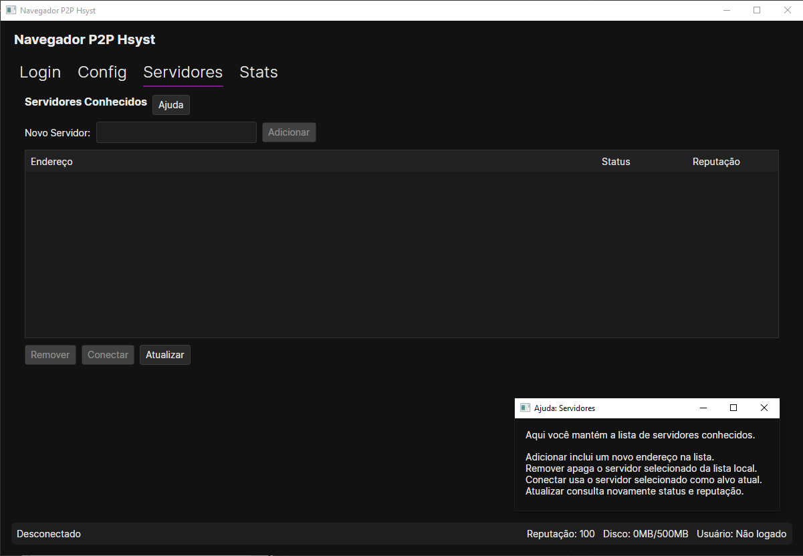

# Hsyst Peer-to-Peer Service (HPS)

> **[Leia em Português (Brasil)](README.pt-BR.md)**
<br>
> **[Leia o Manual Técnico (Português do Brasil)](https://github.com/Hsyst-Eleuthery/hps/blob/main/docs/tecnico.md)**

---

> A federated P2P infrastructure for publishing, digital contracts, identity, decentralized DNS, and native economy — with no central authority.

---

## Screenshots

<table>
  <tr>
    <td></td>
    <td></td>
  </tr>
  <tr>
    <td></td>
    <td></td>
  </tr>
</table>

---

## ⚠️ WARNING

- This project **is not fully open-source**. Please review the [license](LICENSE.md) before running or replicating.
- First time using it? Our official servers are:

  | Priority | Server | Protocol |
  |----------|--------|----------|
  | Primary | `https://server2.hps.hsyst.org` | HTTPS/TLS |
  | Backup 1 | `http://server1.hps.hsyst.org` | HTTP (Backup of HTTPS/TLS) |
  | Backup 2 | `http://server3.hps.hsyst.org` | HTTP (Backup of Backup) |

---

# Download
If you'd like to download, we have a compiled version for Windows and Linux!

- [Click here!](https://github.com/Hsyst-Eleuthery/releases)

---

## Overview

HPS is a **federated peer-to-peer platform** that allows users to:

- Publish content
- Own identities
- Use `hps://` domains
- Create and verify contracts
- Transfer value (vouchers)

All without a central authority.

---

## Goals

- User control over data  
- No hidden censorship  
- Transparent actions  
- Verifiable system  

---

## Architecture

### Server (Go)
Handles storage, contracts and sync.

### Browser (C#)
User interface and navigation.

### CLI (C#)
Advanced interaction and automation.

### Miner (Optional)
Generates vouchers (Proof-of-Work).

### Proxy (Optional)
Improves network communication.

---

## Network Model

- No central server  
- Multiple servers  
- Users can switch freely  
- Identity is portable  

---

## Security Model

- Public/private key identity  
- Signed actions  
- Automatic verification  

---

## Contract System

Everything important is a contract:

- Uploads  
- Transfers  
- Domains  

No contract = no trust.

---

## Distributed Content

Files are stored with:

- Hash  
- Signature  
- History  

---

## Decentralized DNS

```
hps://example.site
```

- Owned domains  
- Transferable  
- No registrar  

---

## Reputation System

- Affects usage  
- Dynamic and visible  

---

## HPS Economy (Vouchers)

Used for:

- Uploads  
- Contracts  
- Domains  
- Anti-spam  

---

## Browser Interface

- Navigation  
- Alerts  
- Verification  

---

## Getting Started

### Requirements

- .NET 8+
- Go 1.20+

### Server

```bash
go run ./server-go
```

### Browser

```bash
dotnet run --project ./browser-cs
```

### CLI

```bash
dotnet run --project ./hps-cli
```

### Miner

```bash
dotnet run --project ./hps-miner
```

---

## Project Structure

```
HPS/
├── browser-cs/
├── server-go/
├── hps-cli/
├── hps-miner/
├── hps-proxy/
```

---

## Philosophy

- Nothing is trusted by default  
- Everything is verifiable  

---

## Status

- Functional  
- Experimental  

---

## License & Credits

Created by [Thaís](https://github.com/op3ny).

---

<p align="center">
  <strong>HPS — Decentralized. Verifiable. Sovereign.</strong>
</p>
