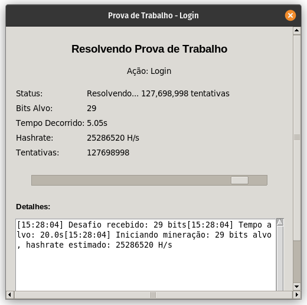
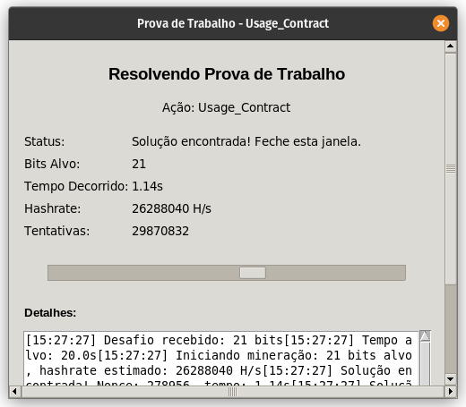

# Hsyst Peer-to-Peer Service (HPS)

> **[Read in English](README.md)**

---

> Uma infraestrutura P2P para publicação, contratos digitais, identidade, DNS descentralizado e economia nativa — sem autoridade central.

---

## Capturas de Tela

<table>
  <tr>
    <td></td>
    <td></td>
  </tr>
  <tr>
    <td></td>
    <td></td>
  </tr>
</table>

---

## ⚠️ AVISO

- Este projeto **não é totalmente open-source**. Verifique a [licença](LICENSE.md) antes de executar ou replicar.
- Utilizando pela primeira vez? Nossos servidores oficiais são:

  | Prioridade | Servidor | Protocolo |
  |------------|----------|-----------|
  | Primário | `server2.hps.hsyst.org` | HTTPS/TLS |
  | Backup 1 | `server1.hps.hsyst.org` | HTTP (Backup do HTTPS/TLS) |
  | Backup 2 | `server3.hps.hsyst.org` | HTTP (Backup do Backup) |

---

## Está em uma Distribuição Linux?

Temos a versão compilada do software — basta baixar e executar!

**[Baixar Última Versão](https://github.com/Hsyst-Eleuthery/hps/releases)**

---

## Manual Técnico

Quer saber a parte mais profunda do projeto?
**[Leia a Documentação Técnica](docs/tecnico.md)**

---

## Sumário

- [Visão Geral](#visão-geral)
- [Objetivos](#objetivos)
- [Arquitetura](#arquitetura)
- [Modelo de Rede](#modelo-de-rede)
- [Modelo de Segurança](#modelo-de-segurança)
- [Sistema de Contratos](#sistema-de-contratos)
- [Conteúdo Distribuído](#conteúdo-distribuído)
- [DNS Descentralizado](#dns-descentralizado-hps)
- [Sistema de Reputação](#sistema-de-reputação)
- [Economia HPS (Vouchers)](#economia-hps-vouchers)
- [Interface do Navegador](#interface-do-navegador)
- [Como Começar](#como-começar)
- [Estrutura do Projeto](#estrutura-do-projeto)
- [Filosofia](#filosofia)
- [Status](#status)
- [Licença e Créditos](#licença--créditos)

---

## Visão Geral

O **HPS (Hsyst Peer-to-Peer Service)** é uma plataforma **peer-to-peer descentralizada**, escrita em **Python**, projetada para permitir que usuários publiquem, transfiram e validem conteúdos digitais de forma **auditável, verificável e resistente a censura**.

O sistema combina conceitos de:

- Redes P2P
- Criptografia assimétrica
- Contratos digitais assinados
- DNS descentralizado
- Reputação distribuída
- Economia interna baseada em esforço criptográfico

Tudo isso **sem depender de servidores centrais, autoridades externas ou confiança implícita**.

---

## Objetivos

O HPS foi projetado para resolver problemas reais de sistemas centralizados:

| Problema | Abordagem do HPS |
|----------|-------------------|
| Falta de soberania sobre conteúdo | Conteúdo do usuário, assinado criptograficamente |
| Dependência de intermediários | Comunicação direta peer-to-peer |
| Censura arbitrária | Moderação transparente baseada em contratos |
| Falta de transparência | Histórico de contratos auditável |
| Dificuldade de auditoria | Hashes e assinaturas imutáveis |
| Abuso por spam ou automação | Proof-of-work e economia de vouchers |

O objetivo **não é substituir a internet tradicional**, mas **oferecer uma camada alternativa**, onde regras são explícitas, registradas e verificáveis.

---

## Arquitetura

O HPS é composto por **dois componentes principais**:

### Servidor

Responsável por:

- Armazenamento distribuído
- Validação de contratos
- Sincronização entre nós
- Gestão de usuários e reputação
- Registro de domínios
- Economia HPS (vouchers)

### Cliente / Navegador

Responsável por:

- Interface gráfica
- Publicação e consumo de conteúdo
- Assinatura de contratos
- Verificação visual de segurança
- Navegação via `hps://`

Ambos são escritos em Python e se comunicam via **Socket.IO + HTTP**.

---

## Modelo de Rede

- **Não existe servidor mestre**
- Qualquer servidor pode entrar ou sair da rede
- Servidores sincronizam dados entre si
- Clientes podem mudar de servidor sem perder identidade
- O estado da rede emerge da soma dos contratos válidos

A rede prioriza **consistência verificável**, não autoridade.

---

## Modelo de Segurança

### Identidade

Cada usuário possui:

- Uma **chave pública**
- Uma **chave privada**

A identidade **não depende de e-mail, IP ou provedor externo**.

### Assinaturas Digitais

São assinados criptograficamente:

- Conteúdos
- Domínios
- Contratos
- Transferências
- Operações econômicas

Qualquer alteração posterior **invalida a assinatura**.

### Verificação

O cliente HPS:

- Valida hashes
- Confere assinaturas
- Detecta adulterações
- Bloqueia automaticamente conteúdos inválidos

A segurança é **ativa**, não opcional.

---

## Sistema de Contratos

O **contrato** é a unidade central de confiança do HPS.

Um contrato define:

| Campo | Descrição |
|-------|-----------|
| **Quem** | O ator que executou a ação |
| **O quê** | A ação realizada |
| **Alvo** | Conteúdo, domínio, app ou valor afetado |
| **Contexto** | Em quais circunstâncias |
| **Quando** | Marca temporal da ação |
| **Assinatura** | Prova criptográfica de autenticidade |

### Exemplos de Contratos

- Upload de conteúdo
- Transferência de domínio
- Mudança de proprietário
- Certificação de material
- Emissão ou transferência de vouchers

Se uma ação **não possui contrato válido**, ela **não é confiável**.

### Violações Contratuais

Quando um contrato é violado:

- O conteúdo pode ser bloqueado
- O domínio perde garantia
- A interface alerta o usuário
- Um novo contrato pode ser exigido
- Um certificador pode intervir

Nada é apagado silenciosamente.
**Tudo deixa rastro.**

---

## Conteúdo Distribuído

O HPS suporta qualquer tipo de arquivo:

- Texto, Imagem, Vídeo, Áudio, Binários

Cada conteúdo possui:

- Hash imutável
- Autor
- Dono
- Assinatura
- Histórico
- Reputação associada

A confiança não vem do arquivo — vem do **contexto contratual**.

---

## DNS Descentralizado (`hps://`)

O HPS implementa um sistema de nomes próprio.

```
hps://meuprojeto.docs
```

Características:

- Domínios têm dono
- Transferências exigem contrato
- Histórico é preservado
- Não depende de ICANN ou registradores

Um domínio é apenas um **contrato apontando para um hash**.

---

## Sistema de Reputação

Cada usuário possui uma reputação dinâmica.

Ela influencia:

- Capacidade de publicar
- Poder de reportar
- Prioridade na rede
- Economia HPS

A reputação é: **transparente, ajustável, registrada e auditável**.

---

## Economia HPS (Vouchers)

O HPS possui uma economia interna simples, mas robusta.

### HPS Vouchers

- Créditos digitais assinados
- Transferíveis
- Rastreáveis
- Usados para operações sensíveis

### Usos

| Operação | Descrição |
|----------|-----------|
| Uploads | Custo para publicar conteúdo |
| Registro DNS | Custo para registrar um domínio |
| Contratos | Custo para criar um contrato |
| Proteção contra spam | Barreira econômica contra abuso |
| Prova de esforço | Validação de esforço criptográfico |

Não é um sistema especulativo — é **funcional**.

---

## Interface do Navegador

O Browser HPS oferece:

- Navegação visual
- Alertas claros
- Análise de contratos
- Comparação de versões
- Confirmações explícitas

A ideia é simples:

> O usuário **entende o que está assinando**.

---

## Como Começar

### Requisitos

- Python 3.10+
- Linux, Windows ou macOS

### Instalar Dependências

```bash
pip install aiohttp python-socketio cryptography pillow qrcode aiofiles tkinter
```

### Iniciar o Servidor

```bash
python hps/hps_server.py
```

> ⚠️ Antes de executar seu servidor HPS, altere a **linha 926** do arquivo, trocando `127.0.0.1` pelo endereço público do seu servidor (domínio, IP público, etc.).

### Iniciar o Navegador

```bash
python hps/hps_browser.py
```

---

## Estrutura do Projeto

```
hps/
├── docs/
│   ├── images/           # Capturas de tela e recursos visuais
│   └── tecnico.md        # Documentação técnica
├── hps/
│   ├── hps_browser.py    # Aplicação cliente / navegador
│   └── hps_server.py     # Aplicação servidor
├── LICENSE.md             # Licença do projeto
├── README.md              # Documentação (English)
└── README.pt-BR.md        # Documentação (Português)
```

---

## Filosofia

O HPS parte de três princípios:

1. **Nada é confiável por padrão.**
2. **Tudo deve ser verificável.**
3. **Autoridade deve ser explícita, nunca implícita.**

Não é uma plataforma de promessas.
É uma plataforma de **provas**.

---

## Status

| Componente | Status |
|------------|--------|
| Arquitetura | Funcional |
| Sistema de contratos | Completo |
| Segurança criptográfica | Madura |
| Interface gráfica | Operacional |
| Economia interna | Ativa |
| Prontidão comunitária | Pronto para testes, forks e experimentação |

---

## Licença & Créditos

Projeto criado por [Thaís](https://github.com/op3ny) para **Hsyst Eleuthery**.

Verifique a licença completa em [LICENSE.md](LICENSE.md).

---

<p align="center">
  <strong>HPS — Hsyst Peer-to-Peer Service</strong><br>
  Descentralizado. Verificável. Soberano.
</p>
