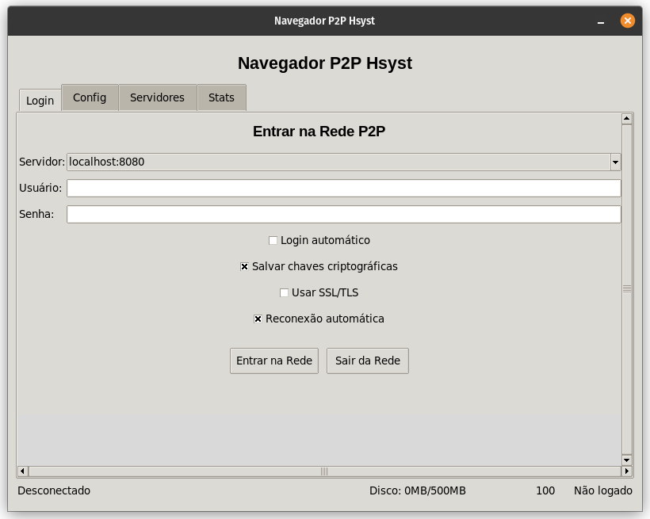
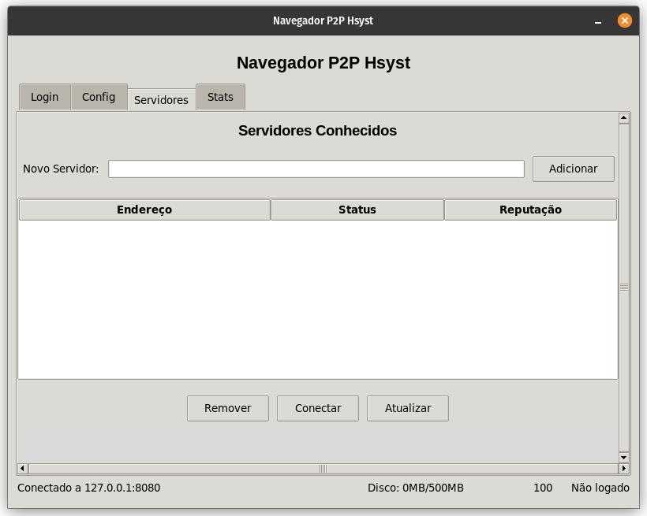

# Hsyst Peer-to-Peer Service (HPS)

> **[Read in English](README.md)**

---

> Uma infraestrutura P2P federada para publicação, contratos digitais, identidade, DNS descentralizado e economia nativa — sem autoridade central.

---

## Screenshots

<table>
  <tr>
    <td></td>
    <td></td>
  </tr>
</table>

---

## ⚠️ AVISO

- Este projeto **não é totalmente de código aberto**. Por favor, leia a [licença](LICENSE.md) antes de executar ou replicar.

- Primeira vez usando? Nossos servidores oficiais são:

| Prioridade | Servidor | Protocolo |
|----------|--------|----------|
| Primário | `https://server2.hps.hsyst.org` | HTTPS/TLS |
| Backup 1 | `http://server1.hps.hsyst.org` | HTTP (Backup de HTTPS/TLS) |
| Backup 2 | `http://server3.hps.hsyst.org` | HTTP (Backup do Backup) |

---

## Download
Caso queira realizar o download, temos uma versão compilada para Windows e Linux!
- [Clique aqui!](https://github.com/Hsyst-Eleuthery/hps/releases)

---

## Visão Geral

O HPS é uma **plataforma peer-to-peer federada** que permite aos usuários:

- Publicar conteúdo
- Possuir identidades digitais
- Usar domínios `hps://`
- Criar e verificar contratos
- Transferir valor (vouchers)

Tudo isso sem uma autoridade central.

---

## Objetivos

- Controle do usuário sobre os dados  
- Sem censura oculta  
- Ações transparentes  
- Sistema verificável  

---

## Arquitetura

### Server (Go)
Responsável por armazenamento, contratos e sincronização.

### Browser (C#)
Interface do usuário e navegação.

### CLI (C#)
Interação avançada e automação.

### Miner (Opcional)
Gera vouchers (Proof-of-Work).

### Proxy (Opcional)
Melhora a comunicação da rede.

---

## Modelo de Rede

- Não há servidor central  
- Múltiplos servidores independentes  
- Usuários podem trocar de servidor livremente  
- A identidade é portátil  

---

## Modelo de Segurança

- Identidade baseada em chave pública/privada  
- Ações assinadas  
- Verificação automática  

---

## Sistema de Contratos

Tudo importante é um contrato:

- Uploads  
- Transferências  
- Domínios  

Sem contrato = sem confiança.

---

## Conteúdo Distribuído

Os arquivos são armazenados com:

- Hash  
- Assinatura  
- Histórico  

---

## DNS Descentralizado

```
hps://example.site
```

- Domínios com dono  
- Transferíveis  
- Sem registrador  

---

## Sistema de Reputação

- Afeta o uso  
- Dinâmico e visível  

---

## Economia HPS (Vouchers)

Usado para:

- Uploads  
- Contratos  
- Domínios  
- Anti-spam  

---

## Interface do Browser

- Navegação  
- Alertas  
- Verificação  

---

## Começando

### Requisitos

- .NET 8+
- Go 1.20+

### Servidor

```bash
go run ./server-go
```

### Browser

```bash
dotnet run --project ./browser-cs
```

### CLI

```bash
dotnet run --project ./hps-cli
```

### Miner

```bash
dotnet run --project ./hps-miner
```

---

## Estrutura do Projeto

```
HPS/
├── browser-cs/
├── server-go/
├── hps-cli/
├── hps-miner/
├── hps-proxy/
```

---

## Filosofia

- Nada é confiável por padrão  
- Tudo deve ser verificável  

---

## Status

- Funcional  
- Experimental  

---

## Licença & Créditos

Criado por [Thaís](https://github.com/op3ny).

---

<p align="center">
  <strong>HPS — Descentralizado. Verificável. Soberano.</strong>
</p>
